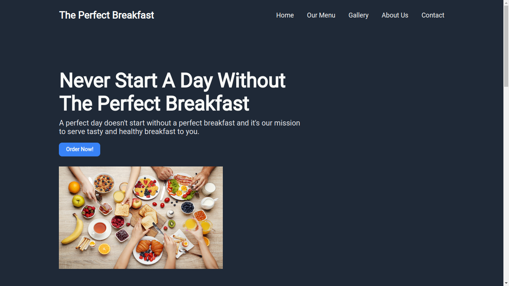
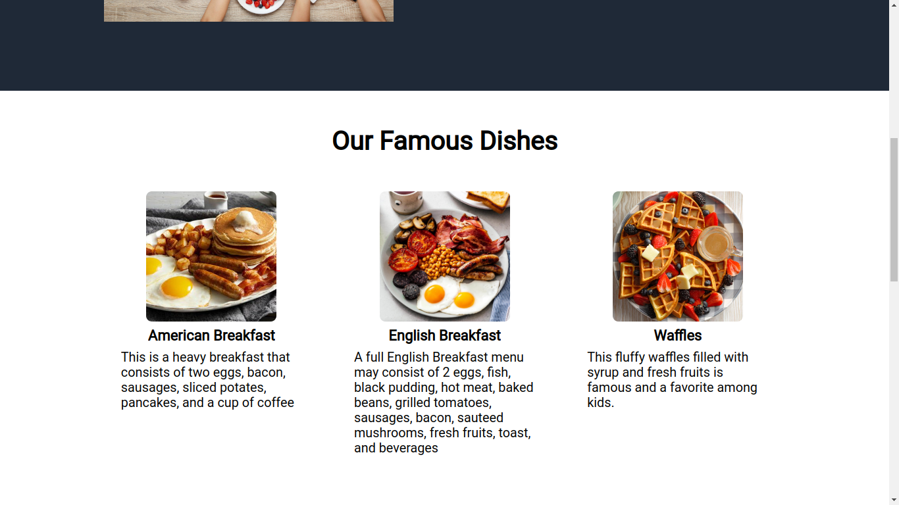
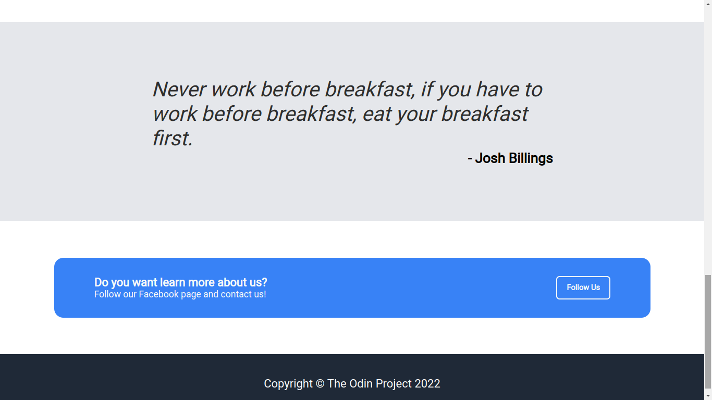

<h1 align="center">Landing Page</h1>
<h3 align="center"><a href="https://gaaabbb.github.io/landing-page/">:film_projector: Live Demo</a></h3>

## :scroll: Description
This project, which was created as part of TheOdinProject's Foundations Course, is a Landing Page to test my skills in HTML and CSS, specifically flexbox. The design and layout used in this project is provided by the course, however the content such as the images and quotes are not included in the provided design.

## :pencil2: Features
* Complete and finished landing page.
* Organized pictures and paragraphs.
* Responsive design that works in all devices.

## :framed_picture: Gallery
#### Hero

#### Dishes

#### Quote and Footer

## :computer: Languages Used
* HTML
* CSS

## :copyright: Credits
### Images
* https://iamafoodblog.com/a-breakdown-of-the-full-english-breakfast/
* https://www.tasteofhome.com/recipes/fluffy-waffles/
* https://www.weightwatchers.com/au/recipe/mixed-vegetable-omelettes/562688d3cb94e20c341768af
* https://www.thejakartapost.com/life/2019/03/23/eating-breakfast-as-a-family-could-boost-childrens-body-image.html
### Descriptions
* https://chefqtrainer.blogspot.com/2020/03/8-types-of-breakfast.html
### Note
*I don't own any of the the images and fonts used in this website. The rights for the materials I used belong to the respective authors and artists.*